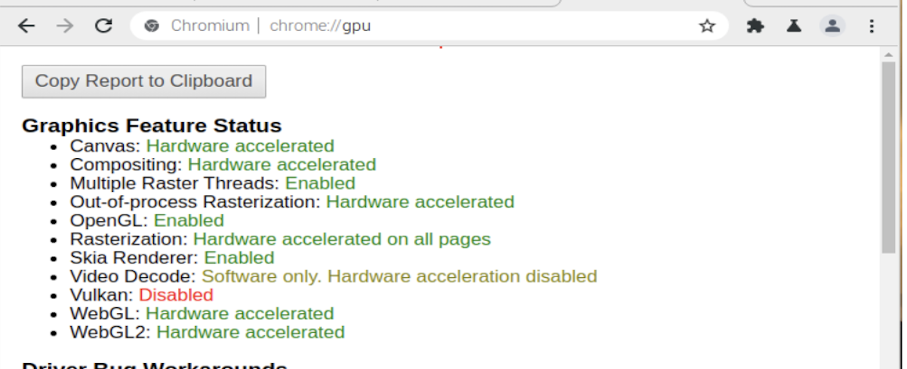

# Promoscreens Backend Setup

Set up the Promoscreen by logging in to the backend with your credentials. *(?Source of credentials?)*<br/>
Login: [Promoscreens Backend](https://promoscreens-stage.sonepar.ch/auth/login)<br/>

*? Create a User and get the Username/Mail and API TOKEN. ?* <br/>

*? Other steps to do ?*

# Raspberry-Pi Promoscreen

Setup of Raspberry-Pi Promoscreen devices running with raspios 32bit (armhf)

## Hardware

Used Hardware: <br/>
- Raspberr Pi Official USB-C Power Supply
- Raspberry PI 4 Computer, Model B 8GB RAM
- PureLink CInema Seriers Micro HDMI - HDMI Cable (CS1200-030)
- SandDisk Extreme Plus 32GB
For the GUI set up, you will also need a USB Keyboard and Mouse.<br/>

Note: Make sure the Micro HDMI cable is conected to the **HDMI0** Port on the Raspberr Pi. (HDMI0 PORT is next to the usbc power supply port. Do **NOT** use HDMI1 port)

## Image
For the stable raspios 32bit (armhf) image go to [raspberrypi.org ](https://downloads.raspberrypi.org)  and Download the newest version of the **raspios_armhf** image.

```
https://downloads.raspberrypi.org/raspios_armhf/images/raspios_armhf-2021-05-28/2021-05-07-raspios-buster-armhf.zip
```
*(Instructions Tested under version: raspios_armhf-2021-05-28)*

Unpack the File and continue with the unpacked "2021-05-07-raspios-buster-armhf.img" image.

## Pi Imager

Install Raspberry Pi OS by Flash the downloaded image onto an clean microSD card.
Use flashing software like: Raspberry Pi Imager or balenaEtcher

- [Raspberry Pi Imager](https://www.raspberrypi.org/software/)
- [balenaEtcher](https://www.balena.io/etcher/)

<br/>


# Image Setup

For setting up the Device, open the just flashed MicroSD which now should be *displayed as  "boot" drive*. 
Before removing the SD and the first boot, the image needs the following steps. <br/>
*If the image/drive is not or not showing as boot, manually remove the drive and reinsert it into your card reader.*

## Device config.txt

Inside the boot folder directory find **config.txt** and replace the file with the [config.txt](config.txt) from this repo. 

*(**Note**: Currently, the device setup is intended for wired LAN connections only. The config disables: wifi, bluetooth and sound on the device.)*
## Setup SSH-Access

For a headless setup, SSH can be enabled by placing a file named ssh, without any extension, onto the boot partition of the SD card. This will activate SSH on the Pi.

**host** => raspberrypi.local <br/>
**username** => pi <br/>
**paswword** => raspberry <br/>

Connect via ssh terminal:
```
ssh pi@raspberrypi.local
```

#### **Removing local cached fingerpint for IP on your device**
In case you already used the Raspberry Pi device with an SSH connection to the pies IP before, you may get an SSH Key Error. Resolve this error by removing the cached fingerprint on your machine.

```
ssh-keygen -R 192.168.1.2  #Local IP of your Raspberry-Pi.
```


# Device Setup

Finally, remove the flashed & configured microSD card from your machine and insert it into the Raspberry-Pi. 
The following Steps take place on the Raspberry-Pi device.

The first boot can take up to 3-5 minutes. During the first boot, the device may restart multiple times.  <br/>

When using the setup with gui: <br/>
If the first boot was successful, you now should be greeted with the "Welcome to the Raspberry Pi Desktop!" Setup window on the desktop of the Pi.<br/>

Follow the Setup Guide instructions:
- Set Country, Language, and Timezone
- Set user and password Raspberry-Pi.
- Set Up your screen in case you see black borders.
- skip wifi installation (if using wired LAN connection.)
- Update & Install Software *(This can take up to 10-20 minutes. On success, it will show a "System is up to date" window.)* 
- Set Up Complete, Restart the Raspberry-Pi


*Tipp: after the reboot, open this repo in the installed browser of the Raspberry-Pi, and follow the instructions there, to easily copy and paste commands from your browser directly*
<!-- - Set up WIFI.  -->
## Firmeware Update
Befor starting<br/>
(again) Update & Upgrade the Raspberry-Pi dependencies and packages:<br/>
*(This should not take much time since the pi should already be up to date.)*
```
sudo apt-get update
sudo apt-get upgrade -y
```
Update & Upgrade the Raspberry-Pi 4s bootloader:<br/>
*(This should not take much time since the pi should already be up to date.)*
```
sudo rpi-eeprom-update
sudo rpi-eeprom-update -a
```

# Browser Installation & Setup
#### Prerequisites

Before setting up the Browser and Chromedriver, install required Graphic Drivers and dependencies in advance.
```
sudo apt-get install -y curl unzip xvfb libxi6 libgconf-2-4
sudo apt-get install libgles2-mesa libgles2-mesa-dev xorg-dev
```
## Browser

The 32bit version of the RaspiOs, comes with the correct chromium-browser already installed.
If you followed the instructions above correctly, you should also have the correct version.
To confirm that, <br/>
Enter: &nbsp;&nbsp;&nbsp;&nbsp;&nbsp;&nbsp;&nbsp;`chromium-browser --product-version` <br/> 

## Driver
<!-- _This could need a bit more improvment, if you run in to problems -> @TrevisGordan_ -->
When using the 32bit version of RaspiOs you will need to install chrome driver via chromium-chromedriver.
Install the regular chromedriver by:

```
sudo apt-get install chromium-chromedriver
```

To confirm installation was correct, and see if chromedriver matches your chromium-browser <br/> 
<!-- Enter: &nbsp;&nbsp;&nbsp;&nbsp;`chromium --product-version` <br/>  -->
Enter: &nbsp;&nbsp;&nbsp;&nbsp;&nbsp;&nbsp;&nbsp;`chromium-browser --product-version` <br/> 
And: &nbsp;&nbsp;&nbsp;&nbsp;&nbsp;&nbsp;&nbsp;&nbsp; `chromedriver --product-version` <br/> 

Both Versions should match.

# Raspi Config Configuration

To open the Raspberry-Pi's Command line Settings enter in Terminal:

```
sudo raspi-config
```

#### Inside Raspi Configuration Window, configure the following settings:

| Configuration | Set |
| :---       |  :---          | 
| Disable sleep mode of Display   | Display Options → D4 Screen Blanking → No.     |
| Video Resolution to 1920x1080/60hz   | Display Options → 1920x1080/60hz. <br/>   |
| GL Driver  | Advanced Options → GL Driver → G2 GL (Fake KMS)     |
| <u>Disable</u> the compositor.   | Advanced Options → Compositor → No     |

<!-- | Video Resolution to 1920x1080/60hz   | Display Options → 1920x1080/60hz. <br/> *(Or use GUI: Einstellungen → Screen Configuration)*    | -->
#### Reboo and Check 3D Drivers

After making these changes, you should be prompted to reboot the Pi. <br/>
Do so, alternatively run
```
sudo reboot
```

After the reboot, check if the settings took effect.

```
cat /proc/device-tree/soc/firmwarekms@7e600000/status
cat /proc/device-tree/v3dbus/v3d@7ec04000/status
```

<!-- If both commands return okay, then the hardware acceleration is working and activated. -->
<!-- #! Well die hardware acceleration läuft aktuell ja sowieso nicht daher einfach schauen ob die anderen driver laufen. -->
If both commands return 'okay', then the Graphic drivers are correctly installed and activated.
<br/><br/>
## Chrome
##### Additonal Plugins

*Currently, for the Raspberry-Pi with 32bit architecture are no recommended Plugins for further Performance Improvements*
<!-- ##### Plugins

Chromium on Raspberry Pi OS comes with uBlock Origin and h264ify extensions installed by default. Make sure that h264ify
is enabled, so YouTube uses h264-encoded videos for which the Raspberry Pi supports hardware-accelerated video decode.<br/>
Additional sources: <br/>
[How to enable hardware acceleration](https://www.linuxuprising.com/2021/04/how-to-enable-hardware-acceleration-in.html) <br/>
[How to make your raspberry pi 4 faster](https://medium.com/for-linux-users/how-to-make-your-raspberry-pi-4-faster-with-a-64-bit-kernel-77028c47d653) <br/>
[Raspberry Pi 4 video acceleration decode chromium](https://lemariva.com/blog/2020/08/raspberry-pi-4-video-acceleration-decode-chromium) <br/> -->


### Enable Chrome Flags:

To enhance the Chrome browser performance. You have to enable special Chrome-Flags inside the Browser.  <br/>
To do that enter following Chrome URLs inside the URL bar <br/>


**Enable:** `chrome://flags/#ignore-gpu-blocklist` <br/>
**Enable:** `chrome://flags/#enable-gpu-rasterization` <br/>

<!-- If Available: <br/> -->
<!-- **Enable:** [chrome://flags/#enable-accelerated-video-decode](chrome://flags/#enable-accelerated-video-decode) <br/> -->

afterwards restart the Chrome browser.

To check the Chrome browser Graphics Feature Status enter: `chrome://gpu` <br/>
*All features should show a green status text (except Vulkan).* <br/>
*Currently on (32bit),  The Video Decode features will show 'Software only..'*



### Clone Github Repository

Make sure you have an ssh public key and have access to the repository. *(Only in case this repository is not public anymore)*

```
ssh-keygen
cat ~/.ssh/id_rsa.pub
```
Clone this Repo as scripts folder.
```
git clone https://github.com/codebar-ag/raspberry-pi-kiosk-32bit scripts 
```
then enter the scripts folder.
```
cd scripts
```
Inside the Repo (scripts folder):
### Install Pyhton Dependencies


On raspi os explicitly use the '**python3**' & '**pip3**' commands to call python. run:
```
pip3 install -r requirements.txt
```

### **Autostart Config Set Up.**

_**NOTE:** SECRETS SHOULD NOT BE VISIBLE IN GIT AND USED WITH ENV VARS._
<br/><br/>
To run the autostart script, the config has to be set up correctly.<br/> 

To establish a connection and AUTH to your server the script needs, a base URL of your backend endpoint, and to authenticate to the endpoint, a Username(email) and Token has to be provided.<br/> 
The scripts config looks for the corresponding environment variables AUTH_TOKEN, AUTH_USER and SCREENURL_BASE inside the script's Current Working Directory (CWD, where the autostart.py is located). <br/> 

There are two ways to provide the environment variables:

#### **I.  Make use of the .env File** 
<!-- ! ADD SCREENURL_BASE env too! -->
By renaming the provided template file **.env.dist** to **.env** or creating your own, then edit the .env file as follows.
Uncomment all needed lines and insert your credentials at the corresponding placeholder. (see example below)   <br/>
Make sure to set your correct base URL for `SCREENURL_BASE=""`.  <br/>
Note: *Only set the base url without paths - especially **dont** use any `/api/identification` path.*
<br/><br/> For more information about the AUTH Process with the Promo screens Backend, see the [API documentation](https://documenter.getpostman.com/view/1711474/TzY3AaiV) <br/>  

In terminal use:

```bash
cp .env.dist .env   # rename env file with cp
nano .env           # edit the .env file 
```
Inside the File:
```bash
#MY_ENV_VAR="This is my env var content."
SCREENURL_BASE="< PLACE BASE URL eg. https://promoscreens.yourdomain.com >"
AUTH_USER="<PLACE YOUR USER EMAIL HERE>"
AUTH_TOKEN="<PLACE YOUR TOKEN HERE>"
```

The Config script will automatically load the token and other environment variables from the env. file to the config.yaml. <br/>


#### **II. Or temporarily set the Environment Variables using export** 
Inside the Scripts CWD run:
```bash
export SCREENURL_BASE="< PLACE BASE URL >"
export AUTH_USER="<PLACE YOUR USER EMAIL HERE>"
export AUTH_TOKEN="<PLACE YOUR TOKEN HERE>" # add environment variable to CWD
```
This will be overwritten/deleted on every boot of the Raspberry-Pi.

The [config.yaml](autostart/config/config.yaml) provides a way to manually set and configure different options*** <br/>
<!-- ### **Screenurls & Endpoints** -->
### Config.yaml File Settings
| **Config File Settings** | |
| --- | --- |
| **Screenurls  & Endpoints** | |
| *placed underneath `screenurls:`* |
| |
| **Option** | **Description** |
| `base` | sets the base URL to your backend *(Default: this is set via environmental variables and env file)*  |
| `identification` | the relative URL path to the backend's API identification endpoint.  |
| `browser_start_url` | The URL to the first page the Kiosk Browser loads on opening, before any request to the backend was made. *(Default: Internal-Offline-Fallbackpage)*  |
| `browser_start_url_is_internal` | set to True/1 if config browser_start_url is a relative internal file path  will then be read as `file://`. *(eg. offlinefallback/index.html)*  |
| `fallback` | the relative internal path to the Internal-Offline-Fallbackpage *(Default: offlinefallback/index.html)*|
| |
| **Server Auth** | |
| *placed underneath `auth:`* |
| |
| **Option** | **Description** |
| `user` | username (email) for basic authenticate *(Default: this is set via environmental variables and env file)*  |
| `token` | token for basic authenticate *(Default: this is set via environmental variables and env file)*  |
| |
| **Other Options** | |
| |
| **Option** | **Description** |
| `homecall_period` | Interval in seconds between every call from device to the backend to check and update the current screen URL *(Default: 60 seconds)* |


# Python Autostart Script


*NOTE*: The Current Working Director of the script is the autostart directory!
Change one directory up to the autostart folder.

```
cd /home/pi/scripts/autostart
```

then run with **python3**

```python
python3 autostary.py
```

autostart will open the chromium in Fullscreen kioskmode.

_Note: To exit the kioskmode close it with ALT+F4_
<br/> <br/> 

## Configure Autostart to automatically start on boot

To continuously automatically start the autostart python script and open the Adscreen after every boot, add `start_on_boot.sh` script to the Raspberry-Pi´s lxsession file. <br/>
Copy the full/absolute path to the [start_on_boot.sh](assets/start_on_boot.sh) file inside the assets directory.
<br/> eg.:  `/home/pi/scripts/assets/start_on_boot.sh`

```bash
sudo nano /etc/xdg/lxsession/LXDE-pi/autostart
```
and add the following line inside the file (with your corresponding file path eg.:) :
```bash
@/bin/bash /home/pi/scripts/assets/start_on_boot.sh
```

Save.<br/> Now on every reboot the browser kiosk will open.
 <br/><br/><br/>
## Common Exceptions:
Common Exceptions on running the python script.

### Wrong Driver Version (64bit Image)
If you run the python script and receive:<br/> <br/> 
**Errors:**
```python
selenium.common.exceptions.SessionNotCreatedException: Message: session not created: This version of ChromeDriver only supports Chrome version 93
Current browser version is 88.0.4324.187 with binary path /usr/bin/chromium-browser
```
This means: Your Browser and Driver versions are different and do not match.
in this example, the ChromeDriver only supports Chrome-Browser version 93. And you have version 88 Installed.


### Wrong Driver Binary (64bit Image)
If you run the python script and receive:<br/> <br/> 
**OSErrors:**
```python
OSError: [Errno 8] Exec format error: 'chromedriver'
```
run: ```which chromedriver``` If this returns
```
bash: /usr/bin/chromedriver: cannot execute binary file: Exec format error
```
This means: you possibly installed a false chromedriver architecture binary. eg. ia32 instead of needed armv7l.
Delete the chromedriver binary and download the right armv7l binary version.